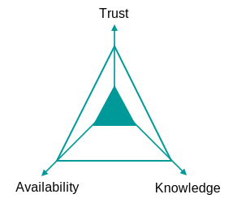

# Integration Guidance

:exclamation: *Work in Progress*

!!! note "TODO"
    We should have guidance (and guidelines?) how to integrate our products with each other:

    * loosely coupled
    * best integrated UX

## Coupling Guidance

Coupling of software refers to the extend of dependency between two software units. The more tightly software units are coupled, the more likely is it that a change in one unit requires a change in other software units. Coupling exist on consumer and provider level. The degree of coupling can be described from *tight* to *loose* with a lot of possible degrees in between. Loose or tight coupling are neither good or bad, there are always benefits and disadvantages.

Loose coupling, for example, has benefits such as:

* less coordination effort
* easier to align software structure and organization
* higher autonomy resulting in higher maintainability, extendibility and flexibility
* faster time to market
* higher stability
* enables heterogeneous systems

Overall this could lead to decreased complexity and effort but there are also disadvantages of loose coupling such as:

* additional effort for managing runtime dependencies and error handling
* often additional integration software/infrastructure and/or operational services are required
* higher risks and efforts regarding operational qualities (performance, security, usability, etc.)
* redundance and consistency handling
* increased effort for e2e testing
* cost/effort of mappings

This could increase the complexity and effort which in the end could eliminate the benefits.
Which means that two software units should always have an adequate degree of coupling.

| Tight coupling   | Loose coupling      |
| :--------------- | :------------------ |
| Highly dependent | Largely independent |
| Many known and unknown dependencies | Few well-known dependencies |
| Consumer impacts provider resource management | Autonomy regarding resource management |
| Good integration experience for the user | Less integrated user experience |

### Degree of coupling

Finding the relevant level of coupling is about distance and constraints:

* Physical distance
* Domain distance
* Organizational distance

*Figure: Distance relevant to decide level of coupling*

Coupling can be tight for close distances but should be loose for larger distances.
Examples:

| Example                                           | level of coupling (example)                               |
|---------------------------------------------------|-----------------------------------------------------------|
| within automation/embedded app                    | very tight coupling allowed                               |
| within app                                        | medium coupling                                           |
| between applications/apps (on one machine)        | medium coupling                                           |
| within self contained systems (impl. to contract) | medium                                                    |
| between self contained systems                    | loose coupling                                            |
| external organizations/customers                  | stable, managed highest possible degree of loose coupling |

The accepted values have to be defined for each category.

### Dimensions of coupling criteria

Coupling criteria can be grouped into the dimensions:

*Figure: Dimensions of coupling criteria*

### Criteria to evaluate coupling

:exclamation: *ToDo*

#### Shared Resource

*Figure: Coupling Criteria: Shared Resources*

#### Isolation

*Figure: Coupling Criteria: Isolation*

#### Interfaces: Client/Consumer coupling

*Figure: Coupling Criteria: Client/Consumer coupling*

#### Interfaces: Provider coupling

*Figure: Coupling Criteria: Provider coupling*

#### Communication

*Figure: Coupling Criteria: Communication*

#### Workflow/Process

*Figure: Coupling Criteria: Workflow/Process*

#### Availability, life cycle and versioning

*Figure: Coupling Criteria: Availability, life cycle and versioning*

#### Reusability

*Figure: Coupling Criteria: Reusability*

### Integration use cases

:exclamation: *ToDo*

Usually integration comes with coupling - The question is how to keep the system values, that are highly demanded by the customer and are a huge benefit.
