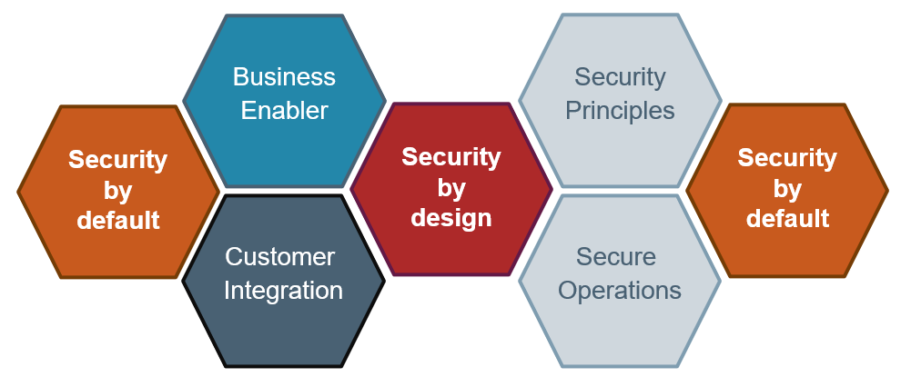

# Security Guidelines

Security-by-design and Security-by-default are major principles that need to be followed for a future-proof and sustainable architecture. Both principles live in a similar environment, but approach different architectural aspect. Both need to become an integral architectural aspect of future architectures.
This chapter gives an overview of different aspects of the Security-by-design and Security-by-default principles.

Security-by-design and Security-by-default not only cover technical measures, like adhering to security principles and establising measures for a secure service or product operation, but also act as business enablers. Siemens products are constantly expanding in the IT field - this expansion will continue - but it needs to be clear:
> *What are our core competencies (make) and where do we attach to already existing solutions (buy) to be in line with overall Siemens' strategy?*

This also applies to the field of security.

!!! tip ""
    The risk associated with security flaws need to be assessed and the return of implemented security measures needs to be clear. We need to build secure systems, but also need to identify and distinguish between measures that make sense, are essential and have a high return and the "expansive measures" (in terms of KPIs, user experience and other parameters) that have only little to no return.

## Security Principles

### Security-by-design

Our future architectures need to be designed around the guiding principles of protecting *Confidentiality*, *Integrity* and *Availability* of data and processes. These are already well known principles and are also evaluated against assets as part of the *Threat and Risk Analysis* (TRA) throughout the project management lifecycle.

As outlined in the [Fua Overview](../20-FuA_Overview/FuA_Overview.md) we need to perform a major shift in designing our product architectures to a more modularized approach. Future product architects will be able to pull modular building blocks into their designs and focus on the innovative parts of their designs. From a security perspective, this means that a particular component can be used in a broader context and needs to have the measures in place to efficiently react to future threats.

On a high level, a secure architecture design differentiates from an insecure architecture design by (not a complete list):

* being aware of its assets and applying adequate protection mechanisms on each level and not relying on a single line of defence (defence-in-depth),
* having a flexible and timely handling of upcoming threats and issues (secure development lifecycle), and
* minimizing the attack surface as well as minimizing the impact in case of an incident (separation of duties, least privilege)

Respecting these principles already in the planning and architectural phase (shift left), results in an architecture/product following the *security-by-design* principle.

> :exclamation: Please find further details, recommendations and guidelines in the [Siemens PSS Wiki](https://wiki.ct.siemens.de/display/PSSKB/Security+Architecture+and+Design+Guidelines). Furthermore, [OWASP](https://wiki.owasp.org/index.php/Category:Principle) and [NIST](https://csrc.nist.gov/publications/detail/sp/800-160/vol-1/final) provides frameworks on secure architecture design

<!-- Consistant way of defining functional building blocks (functions, [edge-, cloud-] apps, automation building blocks,...) with...
...verifiable origin
...verifiable integrity
...defined access rights, verifiable by the operator, restricted to defined access rights by the execution environment
...deployable in different environments (cloud- [mindsphere?], edge- [industrial edge?], field leve, edge enabled devices)
Added Value:
For eco-system users: Consistency
For developers: Know one tech stack - write for all 
-->

### Security-by-default

Another high level principle that deserves special attention is *security-by-default*.
Security is not only technical, but also about acceptance by the user and usability. It needs to be an easy task to get a secured version up and running, without being an security expert. In our connected world it is of outmost importance that shipped devices, software or other products are **secured** before they are shipped to the customer. This includes:

* Using a secure onboarding mechanism, and not having static or predictable default password,
* only ships with a minimal and required set of services,
* no, or only a minimal set of open ports,
* in general, minimize the attack surface,
* using state-of-the-art authentication mechanisms and only granting the necessary permissions to each single user,
* in general, only ship secured 'units' e.g. secured hardware boxes, hardened containers,...

!!! tip "IT Example"
    A newly created user on Linux usually has a very limited set of permissions.  

!!! tip "Consumer Example"
    A brand-new consumer routing device does not have a commonly known default password, it is shipped with a sticker on its back with a random password which cannot be predicted or be derived from router parameters.

> :exclamation: Refer to the [Siemens PSS Wiki](https://wiki.ct.siemens.de/display/PSSKB/Security+Architecture+and+Design+Guidelines) for more detailed recommendations, for different types of products. The wiki also provides [guidelines](https://wiki.ct.siemens.de/pages/viewpage.action?pageId=256541502) especially targeted at hardening containers and operating secure container infrastructures.

<!-- Core Principles: Confidentiality, Integrity and Availability of data/processes
 * Protected by Security Architecture
   * Defense in depth
 * Establish Secure Defaults (secure UX by default)
   * Establish a root of trust
   * Securely store secrets
   * use hardware security modules if available
   * ship components in a secure-by-default state ()
 * Establish Secure Development Lifecycle (modeling, 3rd party tracking, designing testing, coding, reviewing)

https://wiki.ct.siemens.de/spaces/viewspace.action?key=PSSKB
https://wiki.ct.siemens.de/display/PSSKB/Security+Architecture+and+Design+Guidelines
-->

<!-- ### Secure Operations

TBD -->
<!--- * Unified Patch management (brown field, green field)
 * Least privilege
 * Secure onboarding/renewal (offer integration using standards and provide drop-in solution)

-->

## Business Enabler

Customers expect to get *secure products* from a vendor with a proven track-record on security topics. There is already a lot of movement regarding standards and regulations concerning the security of products, but it is just gaining momentum and could lead to customers' mindshift. Our products need to be prepared to meet high security protection levels and provides us a competitive advantage. Eventually security can act as a business enabler.

Security needs to be built into products from the beginning, hence all components and building blocks need to be designed with security in mind to be able to create counter measures for the root cause of an issue, and not being stuck with treating the symptoms.
We need to continue building our security track record.

 <!--- * Siemens is Benchmark for Industrial Security
 * Be prepared for future challenges 
   * regulatory changes
   * market developments
   * Mindshifts after e.g. major incidents  
 * Competitive advantage
-->

## Customer System Integration

Upcoming challengers are pushing from IT to OT. They have highly integrated IT systems, also from a security perspective, and are extending their systems with OT capabilities and devices, offering a fully integrated solution to their customers.
Whenever we are designing new security features we need to put the customer first and design solutions which integrate seamlessly. This especially is a challenging task in the security space, because not every customer has all the security related component available in its infrastructure, or does not have the required security experts on-board, so the challenges in these integrations are manifold. The following is a (not complete list) of integration aspects with high benefits for the customer:

* **Integration vs. drop-in solution:** Customers may or may not have the infrastructure or technical capabilities in place which are required to operate a certain product or service (e.g. certificate infrastructure). We need to be flexible and enable integrations with already existing customer systems (e.g. integration in a customer's CA) as well as offer a fast and easy drop-in solution (e.g. CA instantiated on the Industrial Edge ecosystem) to offer the best possible user experience.

* **Vulnerability & Patch Management:** Due to much higher exposure of OT systems we need to manage (or enable our customers to manage) our systems' vulnerabilities as we do in the IT space. This includes monitoring of the threat landscape and a timely provisioning of security patches. Customers need to be aware of the current security status of their sites. Security is never *done* it's an ongoing process.

* **Centrally manage devices' security configuration:** Security features/configuration (certificates, credentials, trust relationships, ...) will only be used if they are easy to use, and easy to maintain. We need to enable our customers to use a central management.

* **Integration in PKI infrastructures:** Certificate management is just one prominent example of centrally managing a devices' security configuration. Components are increasingly using certificates for various purposes (device authentication, communication authentication, code authentication,...), some of them are long running certificates with lifetimes of 20+ years, others are short lived in the range of weeks or months (communication certificates), and need to be exchanged frequently.

* **User/Role/Permission management:** Another prominent example where customers expect integration with their already existing system is the management of users, roles and permissions.

* **Integrate in monitoring systems (SIEM):** Security Incident and Event Management systems are the core for security operations centers. We need to enable integration into SIEM systems to help customers to react to cyber attacks without unnecessary delay.

* **Brown field integration:** Currently we have a fragmented set of tools for patch management or certificate of brown field systems.

* **Different speeds of IT and OT:** The [Overview](../00-Overview/Overview.md) section already introduces the different innovation speed of different businesses and different speeds of IT and OT. We need to provide the right abstraction levels to dock into changing IT systems and adapt to upcoming trends in the IT space.

<!--- security should be built into products from the beginning, it can’t be added in later;
security should be added to treat the root cause of a problem, not its symptoms;
security is never a goal in and of itself, it is a process – and it must continue throughout the lifetime of the product;
security should never compromise usability – products need to be secure enough, then maximise usability;
security should not require extensive configuration to work, and should just work reliably where implemented;
security should constantly evolve to meet and defeat the latest threats – new security features should take longer to defeat than they take to build;
security through obscurity should be avoided;
security should not require specific technical understanding or non-obvious behaviour from the user.
-->
